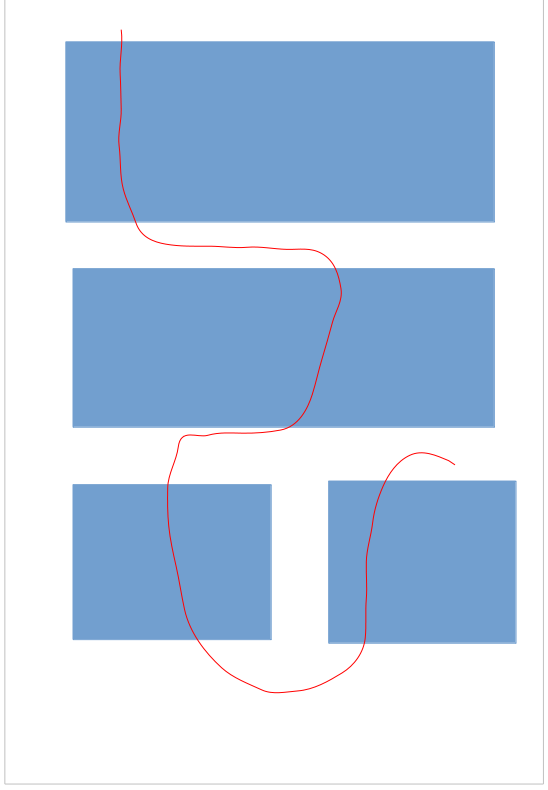

# My dream profile page
## Page(s) que j'aimerais faire
* Je vais mettre une puce pour faire en sorte que ce soit une liste, mais en fait je suis assez fan des "single page website" (si ce sont leurs noms)

## Contenu du site
Un site deroulant qui aurait autour des sections une animation continue pendant tout le temps du scroll (par exemple un serpent qui passerait "devant/derrière" les éléments du site)

## Représentation de ce que j'aimerais faire

En gros, les pages bleues sont du contenu "normal" qu'on pourrait retrouver sur un site. Et en rouge il s'agirait d'un gros serpent animé qui bougerait en boucle + aurait une animation de lumière + mouvement sur les écails (désolé pour le dessin je n'ai pas encore trop l'habitude de ces outils)

## Exemple de site que j'aimerais savoir faire

[lien pour la représentation en dessous](https://reflect.app/?ref=landingfolio)

## How will I make my platform stand out from all the others out there?

AVEC MON GIGA SERPENT ! (en vrai je n'ai encore aucune idée des restrictions des outils/langages, j'attends d'en apprendre un peu plus pour m'aider à visualiser le possible et l'impossible)